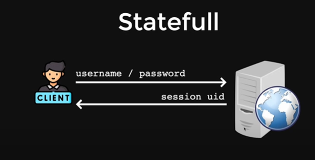
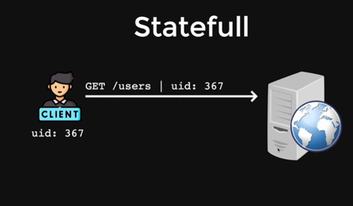
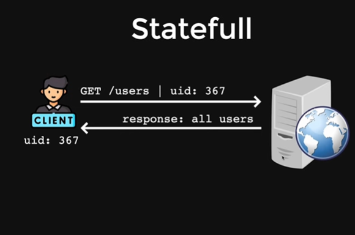
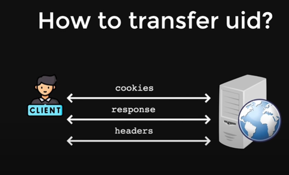
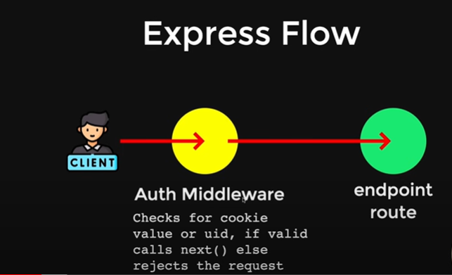
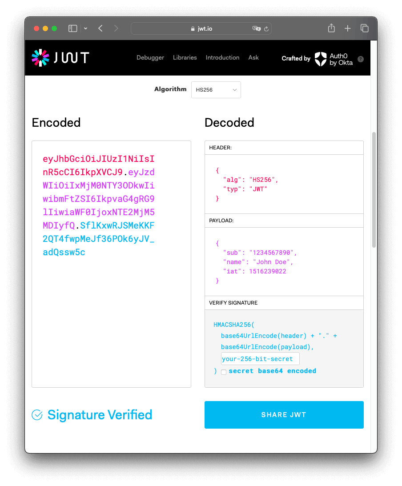

# Authentication Pattern

## Stateful

Stateful authentication maintains state or data on the server side. The state is essentially data mapped to a certain object or session, typically using a unique session identifier (UID).

### Workflow:

1. **Client Authentication:**
   The client enters their username and password. Upon successful authentication, the server generates a session UID and stores it on the server side.
   
   

2. **Client Requests with Session UID:**
   For subsequent requests, the client includes the session UID, usually via cookies or headers.
   
   

3. **Server UID Verification:**
   The server receives the request and verifies the session UID against its stored data.
   
   

4. **Server Authentication Response:**
   If the UID is valid, the server responds with the appropriate data or action. For example, the server might return a response confirming the session is valid for UID 367.
   
   

5. **UID Transfer Methods:**
   Generally, the transfer of UID can be done through cookies in Server-Side Rendering (SSR). In REST API communication, the UID is often included in the headers.
   
   

6. **Express Middleware Handling:**
   This illustrates how Express.js, a web application framework for Node.js, can handle authentication using middleware to verify sessions.
   
   

## Stateless

Stateless authentication, on the other hand, does not maintain any state on the server side. Each request from the client must include all necessary information for the server to understand and verify the request.

### Example:

In stateless authentication, the client typically includes a token (like a JSON Web Token - JWT) with each request. The server decodes and verifies this token without storing any session information.

The problem withsstatefull is that if the server restart or for some reasons the state is loss all the user get logout, Statefull is memory intensive and load on server
So stateless authentication is here to solve the problem , we add state inside the payload
so for doing it i have used json web tokens jwt token

This is how payload data is encoded data is in right side and in left seide it is encoded, we are using jsonwebtoken to store actual data inside the token
 

### Explanation:

- **No Server-Side State:** The server does not keep any session data between requests. Each request is self-contained.
- **Token-Based:** Authentication information is included with each request, often in the form of a token.
- **Scalability:** Stateless authentication can be more scalable as it doesn't require server-side storage of session information.

This approach is commonly used in modern web applications and RESTful APIs.

### Summary:

Both stateful and stateless authentication have their use cases and benefits. Stateful authentication is useful when maintaining a session on the server is beneficial, while stateless authentication offers scalability and simplicity by not requiring server-side session storage.
